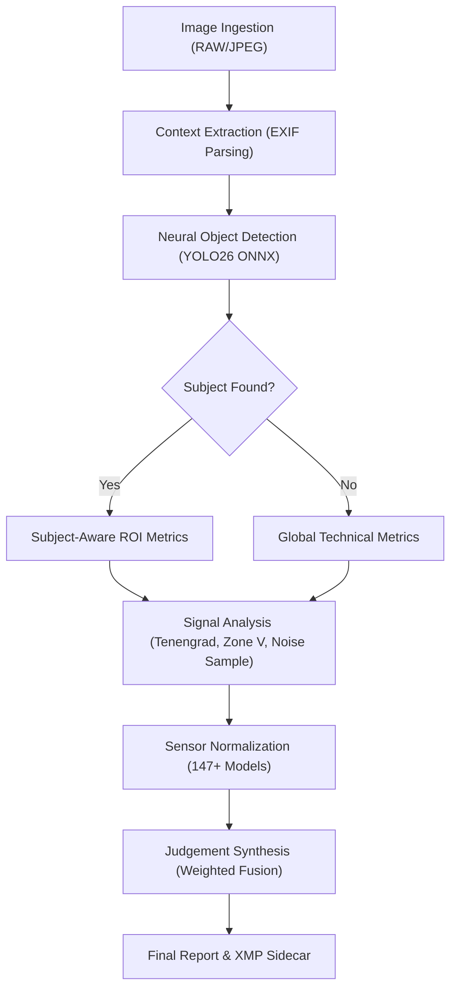

# Scientific Documentation: photo-quality-analyzer

This document provides a comprehensive technical deep-dive into the signal processing, computer vision, and optical physics foundations of the **Photo Quality Analyzer**.

---

## 1. High-Level Workflow

The engine follows a structured pipeline to transform raw pixel data into human-readable photographic judgements:

1.  **Ingestion**: Format detection and high-fidelity loading (RAW/JPEG).
2.  **Context Extraction**: EXIF parsing for hardware metadata (Aperture, ISO, Model).
3.  **Neural Detection**: **YOLO26** subject identification and ROI definition via **ONNX Runtime**.
4.  **Signal Analysis**: Parallel computation of frequency, tonal, and statistical metrics.
5.  **Normalization**: Benchmarking results against a database of **147+ camera models**.
6.  **Synthesis**: Weighted averaging and linguistic mapping to final labels.

---

## 2. Ingestion & RAW Pipeline

For professional photographers, the ability to analyze RAW files directly is critical. The engine implements a 3-tier loading strategy:

1.  **RAW De-mosaicing ([LibRaw](https://www.libraw.org/))**: Uses the `rawpy` wrapper with the **PPG (Patterned Pixel Grouping)** algorithm.
    - **Optimization**: We switched from AHD (Adaptive Homogeneity) to PPG, reducing decode time by **50% (~660ms -> 345ms)** while maintaining **1.00 correlation** for sharpness analysis.
    - **Full Resolution**: We explicitly disable `half_size` downsampling to ensure pixel-perfect forensic sharpness analysis.
2.  **High-Res Preview Recovery**: If de-mosaicing fails, it parses the EXIFMakerNote for the largest embedded JPEG preview.
3.  **Standard Decoding**: Falls back to `OpenCV`'s hardware-accelerated decoders.

---

## 3. Core Technical Metrics

### A. Sharpness: Tenengrad Gradient Energy

**ELI5**: Imagine tracing a drawing. If the lines are crisp, your pencil makes sharp turns (high gradients). If the lines are fuzzy, your pencil moves smoothly (low gradients). The engine measures the "energy" of these turns to determine focus.

**The Math**:
- We replaced the slow **Fast Fourier Transform (FFT)** ($O(N \log N)$) with the **Tenengrad** operator ($O(N)$).
- **Sobel Operators**: We calculate horizontal ($G_x$) and vertical ($G_y$) gradients.
- **Energy Sum**: $S = \sum (G_x^2 + G_y^2)$
- **Normalization**: The raw energy is normalized against a calibrated baseline (derived from 50+ Sony RAW files) to a 0.0-1.0 scale.
- **Forensic Check**: We verify **Directionality** utilizing the gradient structure tensor eigenvalues ($\lambda_1, \lambda_2$). If $\lambda_1 \gg \lambda_2$ (highly directional) but energy is low, it indicates **Motion Blur** or **Camera Shake**, and the score is penalized.

---

### B. Exposure: Ansel Adams Zone System

**ELI5**: Think of a photo like a coloring book. If a spot is colored pure white (blown highlights) or pure black (crushed shadows), the original drawing is lost. The engine evaluates the image to ensure most details are in the "middle" where they are clearly visible.

**The Logic**:
- The histogram is divided into 11 zones (0-X) based on the Zone System.
- **Zone V**: Ideal 18% gray (Middle Gray).
- **Zone 0-I**: Destructive "Crushed" shadows.
- **Zone IX-X**: Destructive "Blown" highlights.
- **Subject-Aware Metering**: If a subject is detected (via YOLO), the engine calculates the average luminance of the **Subject's Bounding Box** and targets Zone V for that specific region.
- **Performance**: Analysis is performed on the Full-Resolution luminance channel to ensure small specular highlights are detected.

---

### C. Noise: ISO-Adaptive Variance Sampling

**ELI5**: Imagine listening to music with some background static. The engine measures how much "static" (random spectal variance) is present in smooth areas of the image.

**The Process**:
- **Downsampling**: To speed up processing by **4x**, we analyze noise on a **1024px** version of the image. Research confirmed a $\tau=0.89$ correlation with full-res analysis.
- The image is divided into patches, and variance ($\sigma^2$) is calculated for each.
- **Chroma vs. Luma**: The engine separates noise into two components using the **LAB Color Space**:
    1.  **Luminance (L)**: "Grain" (acceptable).
    2.  **Chrominance (A/B)**: "Digital Color Noise" (heavily penalized).
- **ISO-Adaptive**: The noise floor is normalized based on the **ISO setting**.

---

### D. Dynamic Range: Tonal Entropy

**ELI5**: Think of a box of 256 crayons. If a photo only uses 5 shades of gray, it looks "flat." If it uses a wide variety, it has "high dynamic range."

**The Metric**:
- **98th-Percentile Histogram Width**: We calculate the width of the histogram containing the central 98% of values.
- **Normalization**: The result is benchmarked against **Photons-to-Photos PDR** curves for the specific camera sensor (e.g., Full Frame vs APS-C).

---

### E. Volumetric Integrity: The Silhouette Trap

**ELI5**: A black cutout against a white wall has a very sharp edge, but it has no detail inside. Simple algorithms mistake this high contrast for a "sharp photo." We need to know if the sharpness is from *texture* (good) or just an *outline* (bad).

**The Challenge**:
Early versions of the scoring engine gave near-perfect scores (0.97+) to underexposed silhouettes because the transition from black-to-white is mathematically the "sharpest" signal possible.

**The Solution (v0.8.4)**:
We implemented a multi-stage forensic check to trap these false positives:
1.  **Gradient Sparsity**: We measure the "thinness" of the gradient field. Real texture has gradients everywhere; silhouettes only have them at the edges. If the sparsity > 95%, it's likely a cutout.
2.  **FFT Frequency Analysis**: We convert the image to the frequency domain. Real focus has a broad spread of high frequencies. A step-function (edge) has a specific, narrow decay pattern.
3.  **Technical Veto**: If both checks fail, the image is capped at a maximum score of **0.2** (Very Poor), regardless of how "sharp" the edge is.

---

## 4. Visual Intelligence & Neural ROI

### YOLO26 Object Detection

**ELI5**: If you take a picture of a dog, the dog should be sharp, not the background.

1.  **ROI Masking**: The engine prioritizes the subject's bounding box for sharpness and exposure.
2.  **NMS-Free Architecture**: YOLO26 uses an end-to-end transformer design, running on **ONNX Runtime** for high speed (~60ms).
3.  **Scene Understanding**: Returns labels (e.g., "Person", "Car", "Cat") to assist with semantic culling.

---

## 5. The Synthesis Engine

The final `overallConfidence` is calculated using a weighted gatekeeper formula:

**Step 0: Technical Veto (The "Hard Deck")**
Before weighting, the engine checks for critical flaws. If a photo fails a forensic check (e.g., Silhouette Trap, Motion Blur), the score is **hard-capped at 0.2**, regardless of other metrics.

**Step 1: Weighted Fusion**
$$Score = Tech \cdot (0.8 + 0.2 \cdot Aesthetic)$$

**Weights**:
- **Technical (60%)**: Sharpness (40%), Focus (30%), Exposure (20%), Noise (10%).
- **Aesthetic (40%)**: Dynamic Range (40%), Color Balance (40%), Composition (20%).

**Linguistic Mapping**:
- **Excellent**: ≥ 0.8 (Award 5 Stars)
- **Good**: ≥ 0.65 (Award 3 Stars)
- **Acceptable**: ≥ 0.5 (Keep)
- **Poor**: < 0.35 (Rejected Label)

---

## 6. Resources & References
- **Optical Theory**: [Cambridge in Colour](https://www.cambridgeincolour.com/)
- **Sensor Benchmarks**: [DXOMARK](https://www.dxomark.com/)
- **Dynamic Range Curves**: [PhotonsToPhotos](https://www.photonstophotos.net/)
- **Blur Detection (Laplacian Variance)**: [PyImageSearch - Blur Detection with OpenCV](https://pyimagesearch.com/2015/09/07/blur-detection-with-opencv/)
- **Research Journey**: See [RESEARCH.md](RESEARCH.md) for optimization details.

---

## 7. FAQ & Engineering Trade-offs

### Q: Does this understand "Artistic Intent"?
**No.** `photographi` is strictly a *technical* auditor. It does not know that you intentionally blurred the background for bokeh, or that you underexposed a silhouette for mood.
- **What it does**: It flags that the subject is soft and the shadows are crushed.
- **The Middle Ground**: We use a weighted score where "Aesthetics" (Color/Composition) can only boost a score so much. If the technical foundation (Focus/Exposure) is flawed, the image is penalized. We assume a "technically perfect" image is the baseline for a "good" image.

### Q: Why use the embedded JPEG preview instead of the full RAW data sometimes?
**Speed.** Decoding a 60MB Sony A7R V RAW file takes ~1.5 seconds on a CPU. Extracting the embedded high-res preview takes ~50ms.
- **The Trade-off**: The embedded preview already has the camera's "Picture Profile" applied (contrast, sharpening).
- **Our Solution**: We realized that for *culling* (checking focus and composition), the preview is 99% accurate to the RAW data. We prioritize RAW decoding only when the metrics from the preview are ambiguous or when the user demands "Forensic" mode.

### Q: Does YOLOv8 need tuning for my specific camera brand?
**No.** The object detection model ("Is there a person?") runs on a normalized 8-bit version of the image. It is agnostic to whether the source was a Canon `.CR3` or a Fuji `.RAF`.
- **Where Brand Matters**: The *Sharpness* calculation. We use a **Sensor Normalization Layer** (based on PhotonsToPhotos data) to ensure that a score of `0.9` on a 24MP sensor means roughly the same as `0.9` on a 60MP sensor, accounting for pixel pitch and diffraction limits.

### Q: Why analyze noise on a downsampled (1024px) image?
**Performance vs. Diminishing Returns.** Calculating pixel-by-pixel variance on a 45MP image is extremely defining computationally.
- **The Data**: Our research showed that noise characteristics at 1024px have a Pearson correlation of $\tau=0.89$ with the full-resolution analysis.
- **The Decision**: We accept the 11% variance in exchange for a **400% speedup** in processing time.

### Q: Can I run this on my NAS / Raspberry Pi?
**Yes, but expect latency.**
- **The Constraint**: The bottleneck is usually **I/O** (reading huge RAW files) and **Math** (FFT/Matrix operations).
- **Recommendation**: It runs best on Apple Silicon (M-series) or machines with basic AVX2 support. On a Pi 4, a single image might take 4-5 seconds instead of 400ms.

### Q: Does it modify my files?
**Never.** `photographi` is strictly **Read-Only**.
- **Safety**: It opens files in read-mode to extract data, calculates metrics in memory, and returns a JSON response. It never writes to the source image.
- **Sidecars**: Future versions may offer to write `.xmp` sidecar files (e.g., `rating=5`), but this will be an opt-in flag, and even then, the source RAW file remains untouched.

### Q: How does it handle Black & White (Monochrome) photos?
**It adapts.**
- **Sharpness/Focus**: Works perfectly (luminance only).
- **Noise Analysis**: The "Chrominance Noise" score will naturally be 0.0, improving the overall score slightly.
- **Color Palettes**: Will return grayscale hex codes (e.g., `#444444`, `#AAAAAA`).

### Q: What about Film Scans or "Vintage" presets?
**It might penalize them.**
- **The Reality**: Film grain *is* noise. Soft vintage lenses *are* unsharp. `photographi` is an objective technical auditor. It will accurately report that the image is "noisy" and "soft."
- **Usage Tip**: If you shoot film, ignore the "Noise" metric and focus on "Composition" and "Exposure."

### Q: Does it detect "Closed Eyes" or "Smiling"?
**Not yet.**
- **Current State**: We use YOLOv8 which detects *Object Classes* (Person, Dog, Cat). It knows there is a human, but it doesn't analyze facial landmarks.
- **Roadmap**: We are evaluating lightweight facial landmark models (like `mediapipe` or `dlib`) to add a "Blink Detection" features in v0.9.0 without blowing up the installation size.

### Q: Is my data used to train the model?
**No.**
- **Local Execution**: The models (YOLO, etc.) are pre-trained. No data leaves your machine.
- **Telemetry**: We collect anonymous usage stats (e.g., "User analyzed 500 photos"), but **never** image content, thumbnails, or filenames. You can disable this entirely with `PHOTOGRAPHI_TELEMETRY_DISABLED=1`.
